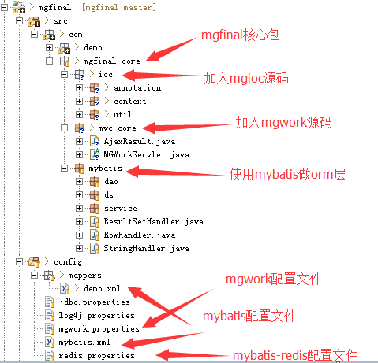
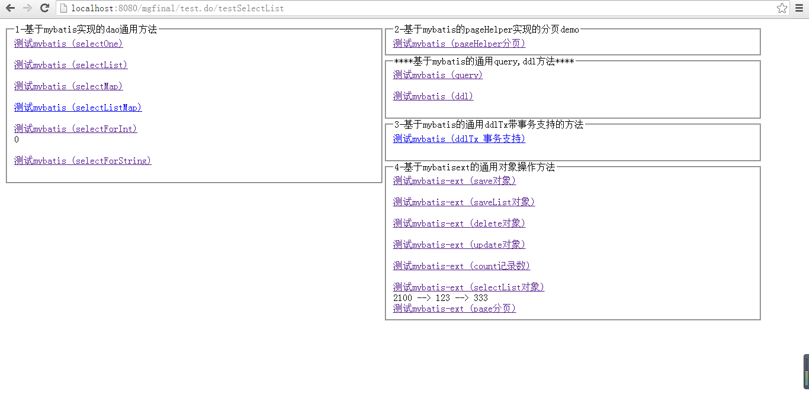
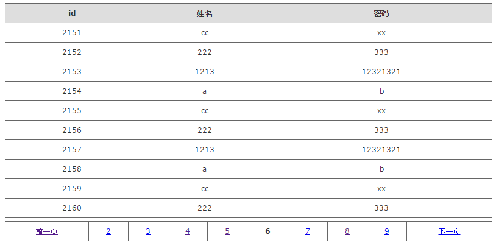
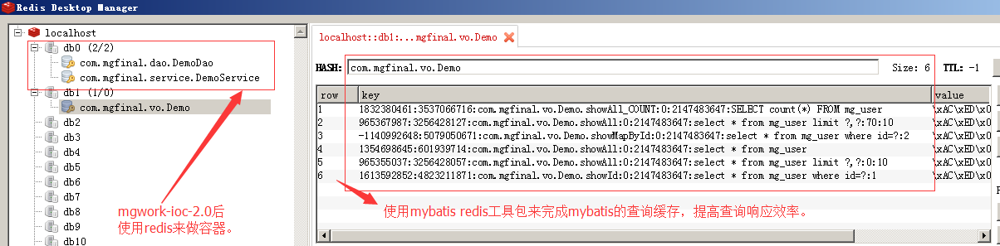

# mgfinal
基于mgwork（servlet3.0多实例非单例）做mvc框架，
mybatis做orm框架，
mgioc做单例容器的mgfinal框架，
mgutil做日志及常用工具方法管理，
致力于打造实用的java后台底层。 
适用于中小型应用，及研究框架底层学习爱好者。

##mgfinal框架源码目录

##相关包
(mgwork-ioc-2.0.jar mgwork-ioc框架集合（mvc + ioc） ----将源码移动到mgfinal中管理）

	
		--fastjson.jar 			json解析包
		--freemarker.jar 			视图包，支持freemarker目前。
		--jedis.jar				使用redis db0来做ioc容器。
	mgutil-1.0.jar				通用工具类模块，包含扫描包，proputil,log4j日志器
		--log4j.jar				log4j日志
	mybatis-xx.jar 	   			mybatis框架(orm)
		--jsqlparser.jar 	
		--pagehelper.jar 			mybatis分页插件
		--mybatisext.jar			mybatis的扩展工具，用来完成对象CRUD操作
	常用数据源
		--c3p0 
			--c3p0-0.9.5.1.jar		c3p0数据源依赖包
			--mchange-commons-java.jar
		--druid
			--druid-1.0.5.jar		druid数据源依赖包
	mybatis-redis.jar				mybatis的二级查询缓存（可选）
		--commons-pool2-.jar		依赖pool2jar
		--jedis.jar				java操作redis的客户端包
	
##mgfinal-1.0版本
	2016-5-13 1:25,生成mgfinal的1.0版本。
	特性：
		1.点对点servlet3.0高速mvc控制跳转。
		2.基于redis为容器的@ToBean,@UseBean高速ioc依赖注入。
		3.支持jsp,html,freemarker的java视图。（后续可以添加更多支持）
		4.集成mybatis的动态sql,通用orm。
		5.集成mybatis-ext的简易对象CURD。
		6.集成mybatis-redis的mybatis二级查询缓存。
		7.支持流行数据源druid,c3p0,及mybatis自带数据源。

##关于作者
一个喜爱代码的狂热工作者，常用名梦网，梦来梦往，mg0324等。 
QQ:1092017732 
github:https://github.com/mg0324 
gitoschina:https://git.oschina.net/mgang 

如果觉得不错的话，别忘了给个star咯。thanks. 

##项目初探
###2016-5-11 demo 图

###2016-5-13 pagehelper demo图

##更新日志
###2016-5-3
1.继承mgwork-2.0 和 mybatis 3.* 到mgfinal框架中。 
2.搭建mybatis底层，初步增加丰富的查询封装。
(selectOne)，(selectList)，(selectMap)，(selectListMap)，(selectForInt)，(selectForString)等 
3.集成PageHelper来实现mybatis分页，新增分页案例及方法(selectPage). 

###2016-5-4
1.整合mgwork-ioc框架，测试通过。 
2.添加2个方法executeUpdate和executeQuery 通用的crud方法。 
3.正在想办法实现事务控制！

###2016-5-10
1.完成事务控制，找到之前的原因（mysql的配置my.ini，未使用innodb的引擎，导致不支持事务。）找到原因后，事务支持成功。 

	//开启事务
	this.demoDao.start();
	//操作1
	this.demoDao.ddlTx("com.mgfinal.vo.Demo.addDemo", p);
	//操作2
	this.demoDao.ddlTx("com.mgfinal.vo.Demo.addDemo", p);
	//提交事务
	this.demoDao.end();

2.start,end的事务，放到master主分支中。另外还有一个基于SqlHelper先获取sql,然后conn来commit,rollback的事务支持提交到了v0.1分支。 
3.修改方法名称 executeUpdate -> ddl , executeQuery -> query , executeUpdateWithTx -> ddlTx，只要是简单明了。 
4.添加数据源支持常用数据源支持driud,c3p0等。 
c3p0: 
①添加jar包支持c3p0-0.9.5.1.jar和mchange-commons-java-0.2.10.jar 
②mybatis.xml配置文件中，配置数据源如下

	<dataSource type="com.mgfinal.core.mybatis.ds.C3P0DataSourceFactory">
        <property name="driverClass" value="${driver}" />
        <property name="jdbcUrl" value="${url}" />
        <property name="user" value="${username}" />
        <property name="password" value="${password}" />
        <property name="idleConnectionTestPeriod" value="60" />
        <property name="maxPoolSize" value="20" />
        <property name="maxIdleTime" value="600" />
        <property name="preferredTestQuery" value="SELECT 1" />
    </dataSource>
driud: 
①添加jar包支持druid-1.0.5.jar 
②mybatis.xml配置文件中，配置数据源如下

	<!-- druid数据源 -->
    <dataSource type="com.mgfinal.core.mybatis.ds.DruidDataSourceFactory">
    	<!-- 基本属性 url、user、password -->  
    	<property name="driver" value="${driver}" />
	    <property name="url" value="${url}" />  
	    <property name="username" value="${username}" />  
	    <property name="password" value="${password}" />  
	    <!-- 配置初始化大小、最小、最大 -->  
	    <property name="initialSize" value="1" />  
	    <property name="minIdle" value="1" />   
	    <property name="maxActive" value="20" />  
	    <!-- 配置获取连接等待超时的时间 -->  
	    <property name="maxWait" value="60000" />  
	    <!-- 配置间隔多久才进行一次检测，检测需要关闭的空闲连接，单位是毫秒 -->  
	    <property name="timeBetweenEvictionRunsMillis" value="60000" />  
	    <!-- 配置一个连接在池中最小生存的时间，单位是毫秒 -->  
	    <property name="minEvictableIdleTimeMillis" value="300000" />  
	    <property name="validationQuery" value="SELECT 'x'" />  
	    <property name="testWhileIdle" value="true" />  
	    <property name="testOnBorrow" value="false" />  
	    <property name="testOnReturn" value="false" />  
	    <!-- 打开PSCache，并且指定每个连接上PSCache的大小 -->  
	    <property name="poolPreparedStatements" value="true" />  
	    <property name="maxPoolPreparedStatementPerConnectionSize" value="20" />  
    </dataSource>
5.升级mgwork-ioc-1.2.jar，将日志常用操作丢给mgutil来管理。 
###2016-5-11
1.集成mybatisext来完成对象CRUD操作的通用方法实现，包括(save,delete,update,one,list,page,count等); 

###2016-5-13
1.集成mgwork-ioc-2.0.jar，使用redis来做ioc容器，默认使用的是redis的0数据库。
(请升级mgwork-ioc-2.0.jar，欢迎到http://git.oschina.net/mgang/mgwork下载) 
	
	注意点：1.redis存储对象，需要改对象实现Serializable序列化接口。
			所以service抽象了一层BaseService,目前用做序列化实现。
			dao的序列化交给了baseDaoImpl来实现。
			vo,bean的部分，就需要自己手动加上了。
		  2.在mgwork.properties中加上配置ioc容器的redis服务。
		  	#redis服务主机
			mg.ioc.redis.host = localhost
			#redis服务端口
			mg.ioc.redis.port = 6379
			
2.使用mybatis-redis.jar工具包，来做mybatis查询缓存，提供查询响应效率。 	
	
	注意点：1.加入mybatis-redis-1.0.0-beta2.jar包。
		  2.在要使用查询缓存的mapper中首行加上配置。
		  	<!-- redis缓存 -->
			<cache type="org.mybatis.caches.redis.RedisCache" />
		  3.可以开启mybatis中的自身缓存（一级），redis就算做2级缓存了。在mybatis.xml主配置文件中
		  加上settings节点如下：
		  	<settings>
				<!-- 这个配置使全局的映射器启用或禁用缓存 -->
				<setting name="cacheEnabled" value="true" />
				<!-- 对于未知的SQL查询，允许返回不同的结果集以达到通用的效果 -->
				<setting name="multipleResultSetsEnabled" value="true" />
				<!-- 配置默认的执行器。SIMPLE 执行器没有什么特别之处。REUSE 执行器重用预处理语句。BATCH 执行器重用语句和批量更新 -->
				<setting name="defaultExecutorType" value="REUSE" />
				<!-- 全局启用或禁用延迟加载。当禁用时，所有关联对象都会即时加载。 -->
				<setting name="lazyLoadingEnabled" value="false" />
				<setting name="aggressiveLazyLoading" value="true" />
				<!-- <setting name="enhancementEnabled" value="true"/> -->
				<!-- 设置超时时间，它决定驱动等待一个数据库响应的时间。 -->
				<setting name="defaultStatementTimeout" value="25000" />
			</settings>
3.加入mybatis-redis要的配置文件，配置查询缓存连接的redis服务，如下：
	
	#使用redis的第2个数据库来做mybatis查询缓存
	host=localhost
	port=6379
	connectionTimeout=5000
	soTimeout=5000
	password=
	#选择数据库，0被mgwork-ioc占用
	database=1
	clientName=
4.使用redis图形客户端查看redis数据库中的key情况：

5.生成mgfinal-1.0版本，导出jar包为mgfinal-1.0.jar。

6.加入mgwork ioc等源码，让mgfinal管理，并调整目录。更改web.xml中mgfinal ioc监听启动配置。

	<listener>
		<listener-class>com.mgfinal.core.ioc.context.IocListener</listener-class>
	</listener>

7.后续会编写使用手册，有需要，可以收藏，等待手册。

